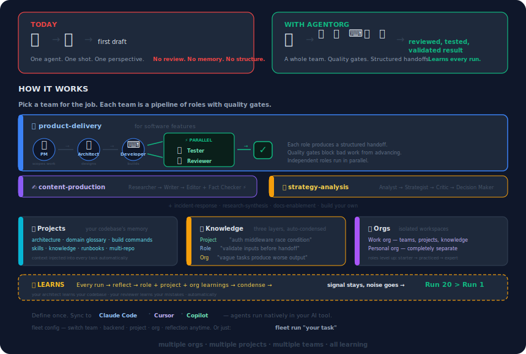

# AgentOrg

**Work like a CEO.**

Delegate. Don't do.

<p align="center">
  
</p>

```bash
fleet run "Add rate limiting to the API"
```

Your PM scopes it. Your architect designs it. Your developer builds it. Your tester and reviewer check it — in parallel. Each role hands off structured artifacts to the next. Quality gates block bad work. And your whole org gets smarter with every run.

## Why

**A CEO doesn't ship features. A CEO runs an organization that ships features.**

Today's AI assistants put you in every seat at once — PM, architect, developer, tester, reviewer. That's not leverage; it's a to-do list with better autocomplete. You're still doing every role's job, just faster.

AgentOrg gives you what a CEO has:

- **An organization.** Roles with missions. Teams with process. Quality gates that block bad work.
- **Delegation, not dictation.** You set direction. Your org executes. You review, decide, move on.
- **Pick the right team for the job.** Product delivery for features. Strategy analysis for decisions. Content production for writing. Incident response for ops. Six starter teams; build your own.
- **Or call in a single specialist.** Don't need the whole team? Ask just the architect, or just the critic. Same CEO seat, narrower cut.
- **Institutional memory.** Your architect learns your codebase. Your reviewer learns your common mistakes. Learnings condense — signal stays, noise goes. Run 20 is better than run 1.
- **Separate orgs for separate contexts.** Work org, personal org, experimental org. Roles and knowledge don't leak between them.

Define it once. Run it everywhere — Claude Code, Cursor, or Copilot.

```bash
fleet run "Add rate limiting"                    # default team (or role)
fleet run --team content-production "write blog" # pick a team for this one
fleet run --role architect "should we use X?"    # call in one specialist
fleet run --project my-api "Add auth"            # in a codebase context
fleet run --new "rate limiting"                  # draft a spec first, then run

fleet config set team strategy-analysis          # switch default team
fleet config set role architect                  # switch to role mode
```

You're the CEO. One command sets direction. Your org does the rest.

## Honest pitch: do you actually need this?

At the end of the day, AgentOrg launches Claude Code (or Cursor, or Copilot). Everything it does — roles, teams, handoffs, learnings — you *could* piece together by writing agent files, CLAUDE.md entries, and prompt instructions by hand. So the real question is: what does fleet give you that rolling your own doesn't?

**You don't need fleet if:**
- You use one AI tool, one codebase, one workflow
- You're happy maintaining agent `.md` files and CLAUDE.md directly
- A good prompt and maybe a subagent or two covers your needs

**Fleet is worth it if you want:**
- **One org definition, many AI tools.** Fleet syncs the same roles/teams to Claude Code, Cursor, and Copilot. If you use more than one, you define it once.
- **Isolated orgs for different contexts.** Work vs personal vs experimental — each with its own roles, knowledge, and history. No leakage. Claude Code has one `~/.claude/`.
- **Team compositions as versioned config.** A team YAML with role dependencies is committable, reviewable, shareable. Your team knows what "product-delivery" means because it's in git.
- **Structured learnings that don't drift.** Three explicit layers (role / project / org). Automatic condensation after N reflections — signal stays, noise goes. Changelog for lineage. Freeform agent memory doesn't give you this.
- **Project context that travels with every task.** Architecture, glossary, build commands, failure modes — injected automatically on every run in that project. CLAUDE.md covers some of this; project-level knowledge accumulation across runs doesn't exist there.
- **Predictable commands, not prompts.** `fleet run`, `fleet project use`, `fleet config set team X` — an opinionated CLI that models the work, instead of "ask your AI to do X the right way."

**What's still unproven:**
- Does run 20 actually outperform run 1? The intelligence loop compounds learnings, but we don't have measured data.
- Does the multi-pass team output beat a single well-prompted agent? Multiple roles give multiple perspectives, but they also cost more.

If the honest pitch matches how you want to work, read on. If not, a good `CLAUDE.md` and a few subagents may be all you need.

## Install

```bash
# Install uv if you don't have it (https://docs.astral.sh/uv/)
curl -LsSf https://astral.sh/uv/install.sh | sh

# Install AgentOrg (requires Python 3.11+)
uv sync && uv pip install -e .
```

## Quick start

```bash
# 1. Install and initialize (one time)
uv sync && uv pip install -e .
fleet init

# 2a. Run a task directly — uses active team + scratch dir
fleet run "Add a /health endpoint"

# 2b. Run in a specific project — creates the project if missing
fleet run --project my-api "Add rate limiting"

# 2c. Write a detailed spec, then run it
fleet run --new "rate limiting"     # scaffolds a spec, opens in $EDITOR,
                                    # runs after you save
```

That's it. `fleet run` is the one verb you need. Everything else is
configuration or building your org.

See [Projects](#projects) below for persistent codebase context, and
[`agentorg/starters/examples/`](agentorg/starters/examples/) for task
spec examples.

### Natural language (uses your backend LLM)

Don't remember the exact command? Just say what you want:

```bash
fleet "show me all my projects"
fleet "switch to the strategy team"
fleet "what has my org learned"
```

Fleet sends your query to the active backend's LLM, which translates it into the right `fleet` command and runs it. You'll see the translated command before it executes:

```
→ fleet project list
  ...
```

This costs one LLM call per query. For commands you know, use them directly — it's faster and free.

---

## What happens when you run a task

`fleet run` syncs your agents, then hands off to your backend (Claude Code, Cursor, or Copilot). The backend runs the team — fleet doesn't stay in the middle.

```
fleet run "your task"
  → Syncs agents to ~/.claude/agents/ (or ~/.cursor/agents/, ~/.squad/)
  → Launches: claude --agent fleet-product-delivery-lead "your task"
  → Claude Code takes over — you see live output
  → fleet-lead orchestrates the team:

      Stage 1:            PM → scopes the work
      Stage 2:            Architect → designs the implementation
      Stage 3:            Developer → writes code, runs validation
      Stage 4 (parallel): Tester + Reviewer → both run at the same time
      If issues found:    loops back through developer + reviewer

  → Final result: what was done, files changed, how to verify
  → Reflection → learnings saved for next time
```

**Roles run in parallel when they can.** Teams define a dependency graph — roles with the same dependencies run simultaneously. Each backend uses its native parallel execution:
- **Claude Code** — creates an agent team; each teammate gets its own context window (and its own tmux pane if configured)
- **Cursor** — invokes subagents via `/fleet-{org}-{role}`, nested delegation supported
- **Copilot** — uses the native `/fleet` command for parallel dispatch

### See agents working in separate panes (Claude Code)

To see each role's output in its own tmux pane as they run:

```bash
# 1. Enable experimental agent teams (required once)
# Add to ~/.claude/settings.json:
{
  "env": { "CLAUDE_CODE_EXPERIMENTAL_AGENT_TEAMS": "1" }
}

# 2. Set pane display mode (required once)
# Add to ~/.claude.json:
{ "teammateMode": "tmux" }

# 3. Start a tmux session (required every time — panes only work inside tmux)
tmux new -s fleet

# 4. Run fleet from inside tmux
fleet run "your task"
```

Without tmux, agent teams still work — you'll see the output inline instead of in panes.

Each role produces a structured **handoff** before the next stage starts. Quality gates enforce that blocked roles stop the pipeline.

---

## Context switches

`fleet config` shows and changes everything that affects how `fleet run` behaves:

```bash
fleet config                               # show current config and context
```

```
  team:              product-delivery
  backend:           claude
  project:           my-api
  org:               default
  reflection:        auto
  condense_after:    5
  org_home:          ~/.agent-org
```

```bash
fleet config set team strategy-analysis    # switch team
fleet config set backend cursor            # switch backend
fleet config set project my-api            # switch project
fleet config set reflection review         # switch reflection mode
fleet config set condense_after 10         # condense learnings every 10 reflections
fleet config clear project                 # deactivate project (one-off mode)
```

Then just work:

```bash
fleet run "do the thing"        # uses all the context above
fleet reflect                   # reflects on active project
fleet learnings                 # shows active org's learnings
```

No flags needed. Override per-run with `--team <id>` or `--solo` when you need a different team for one task.

Use `fleet sync` manually only when you want to update agents without running a task — e.g., after hiring a new role or changing a team.

---

## Concepts

### Projects

A project is the institutional memory of a codebase. Three things make your org smarter about *this specific system*:

- **Context** — architecture, domain glossary, system boundaries. You write this once.
- **Knowledge** — learnings accumulated from running tasks. Grows automatically with every run.
- **Skills** — procedures specific to this codebase. Just create a `SKILL.md` in the project's `skills/` directory.

```bash
fleet project create my-api               # create (records cwd as repo path)
fleet project create my-api --path ~/git/my-api  # or specify the path
fleet project use my-api                  # activate
fleet project clear                       # deactivate (one-off mode)
fleet project list                        # list all
fleet project                             # show active
```

**Multi-repo projects:** a project can span multiple repositories.

```bash
fleet project use payments
fleet project add-repo ~/git/billing-service
fleet project add-repo ~/git/shared-types
```

Creating a project scaffolds:

```
~/.agent-org/projects/my-api/
  project.yaml              ← repo paths
  context/
    architecture.md         ← how the system is structured
    domain-glossary.md      ← terms your team should know
  commands/
    build-test-lint.md      ← what the developer/tester should run
  runbooks/
    common-failures.md      ← known issues and workarounds
  skills/                   ← project-specific procedures (SKILL.md files)
  knowledge/
    learnings.md            ← accumulated from runs (auto-updated)
  tasks/                    ← task specs + run history
```

**Projects are opt-in.** No project active = one-off mode, no project context. Activate one and everything flows.

### What your org knows during a run

```
┌──────────────────────────────────────────────┐
│  Project skills      deploy, run-migrations  │  ← this codebase's playbooks
│  Project knowledge   "auth middleware is..."  │  ← learned from past runs here
│  Project context     architecture, glossary   │  ← you wrote this once
├──────────────────────────────────────────────┤
│  Org knowledge       cross-project patterns   │  ← learned across all projects
│  Role knowledge      role-specific patterns   │  ← learned for this role
│  Role skills         code-review, research    │  ← assigned org-wide skills
│  Role definition     mission, exit criteria   │  ← the persona itself
└──────────────────────────────────────────────┘
```

Switch projects, and the bottom layers stay — the roles bring their general expertise. The top layers change to the memory of *that* codebase.

### Roles

A role defines what an agent does — mission, required inputs, exit criteria, skills.

```bash
fleet role create content-editor          # create
fleet role adopt architect                # copy starter for customization
fleet architect                           # view details + knowledge
```

19 starter roles across software, content, strategy, research, ops, and docs.

### Teams

A dependency graph of roles with quality gates. Roles with the same dependencies run in parallel.

```bash
fleet team create content-pipeline
```

```yaml
team_id: content-pipeline
roles:
  - id: researcher
  - id: writer
    depends_on: [researcher]
  - id: editor
    depends_on: [writer]
  - id: fact-checker
    depends_on: [writer]       # editor + fact-checker run in parallel
gates:
  reviewer_required: true
  tester_required: false
```

6 starter teams. Flat `personas:` lists (no `depends_on`) still work — they're treated as sequential.

### Skills

Reusable procedural knowledge — how to do code review, risk assessment, research, etc.

```bash
fleet skill                                       # list
fleet skill add-to-role architect risk-assessment
fleet skill create api-design
```

4 starters: `code-review`, `research`, `risk-assessment`, `fact-checking`.

Project-specific skills go in the project's `skills/` directory as `SKILL.md` files — they're automatically available to all roles when that project is active.

### Intelligence loop

After each run, reflection analyzes what worked and what didn't:

```
Task executes → output saved
  → Reflection analyzes the run
  → Role learnings    → the role gets smarter at its job
  → Project learnings → this codebase's institutional memory grows
  → Org learnings     → cross-project patterns accumulate
  → Role levels updated (starter → practiced → experienced → expert)
  → Next run includes all new knowledge
```

| Layer | What it captures | Example |
|-------|-----------------|---------|
| **Role** | Role-specific patterns | "Validate inputs before handoff" |
| **Project** | Codebase-specific patterns | "Auth middleware has a race condition under load" |
| **Org** | Cross-project patterns | "Vague tasks produce worse output" |

Reflection behavior is configurable:

```bash
fleet config set reflection auto           # default — automatic after every run
fleet config set reflection review         # show learnings for approval before saving
fleet config set reflection off            # no automatic reflection
```

### Backends

Fleet defines the org. The backend runs it. `fleet run` syncs agents and then **hands off to the backend** — fleet doesn't stay in the middle.

```bash
fleet config                               # show active backend + install status
fleet config set backend copilot           # switch
```

| Backend | Agents written to | How `fleet run` executes |
|---------|------------------|--------------------------|
| **Claude Code** | `~/.claude/agents/fleet-*.md` + team lead in main session | launches `claude` with the lead template as the orchestration prompt |
| **Cursor** | `~/.cursor/agents/fleet-*.md` with subagent delegation | launches `cursor` with a prompt that delegates to `/fleet-{org}-{role}` subagents |
| **Copilot** | `~/.squad/` with `/fleet` | launches `copilot` / `squad` with a prompt that uses the native `/fleet` command for parallel dispatch |

For Claude Code, `fleet run` launches Claude Code interactively with the team lead agent. The lead spawns subagents (one per role), manages handoffs, runs stages in parallel, and produces the final result. You see everything live in your terminal.

Agents are named `fleet-{role}.md` by default. Team leads are `fleet-{team}-lead.md`. If you use multiple orgs, named orgs get `fleet-{org}-{role}.md` to avoid collisions.

### Settings

```bash
fleet config                               # view all
fleet config set default_team strategy-analysis
fleet config set reflection review         # auto, review, or off
```

---

## Starter teams

| Team | Roles | Parallel stages | Domain |
|------|-------|----------------|--------|
| `product-delivery` | PM → Architect → Developer → Tester + Reviewer | Tester & Reviewer | Software |
| `content-production` | Researcher → Writer → Editor + Fact Checker | Editor & Fact Checker | Content |
| `strategy-analysis` | Analyst → Strategist → Critic → Decision Maker | | Strategy |
| `research-synthesis` | Question Framer → Researcher → Synthesizer → Critic | | Research |
| `incident-response` | Triager → Root Cause → Resolution Drafter → Reviewer | | Ops |
| `docs-enablement` | PM → Developer → Docs Reviewer | | Docs |

---

## CLI reference

```
Setup:
  fleet init                                 First-time setup
  fleet config                               View all settings + active context
  fleet config set <key> <value>             Set team, backend, project, reflection,
                                             org, condense_after, scratch_dir, org_home
  fleet config clear project                 Clear active project

Daily:
  fleet                                      Show org status + active context
  fleet <name>                               Smart dispatcher — shows details for a
                                             role / team / project / org / skill
  fleet ask "<question>"                     Natural language routing
  fleet learnings                            What your org has learned
  fleet sync                                 Sync to active backend (auto-run by run)

Run:
  fleet run <task>                           Execute via active team + backend
  fleet run --team <id> <task>               Through a specific team
  fleet run --role <id> <task>               Single-role execution
  fleet run --solo <task>                    Solo mode (active team's lead only)
  fleet run --new <name>                     Scaffold a task spec in the active
                                             project, open in $EDITOR, then run
  fleet run --new <name> --no-run            Scaffold only
  fleet run path/to/task.md                  Task from a file
  fleet run --prompt <task>                  Output prompt without executing

Role (persona):
  fleet role                                 (same as fleet role list)
  fleet role list                            List roles
  fleet role create <id>                     Create a role
  fleet role edit <id>                       Edit a role in $EDITOR
  fleet role remove <id>                     Remove a role from your org
  fleet role adopt <id>                      Copy a starter role to your org
  fleet role contribute <id>                 Copy a role to the repo for sharing

Team:
  fleet team                                 List teams
  fleet team create <id>                     Create a team
  fleet team edit <id>                       Edit a team in $EDITOR
  fleet team remove <id>                     Remove from your org
  fleet team adopt <id>                      Copy a starter team to your org
  fleet team contribute <id>                 Copy a team to the repo

Skill:
  fleet skill                                List skills
  fleet skill create <id>                    Create a skill
  fleet skill edit <id>                      Edit in $EDITOR
  fleet skill remove <id>                    Remove from your org
  fleet skill add-to-role <role> <skill>     Attach a skill to a role
  fleet skill remove-from-role <role> <skill>  Detach a skill from a role
  fleet skill adopt <id>                     Copy a starter skill to your org
  fleet skill contribute <id>                Copy a skill to the repo

Project:
  fleet project                              Show active project
  fleet project list                         List all projects
  fleet project create <id> [--path <dir>]   Create a project
  fleet project edit <id>                    Edit project.yaml in $EDITOR
  fleet project use <id>                     Activate a project
  fleet project clear                        Deactivate the current project
  fleet project remove <id>                  Delete a project directory
  fleet project add-repo <path>              Add a repo to active project

Org:
  fleet org                                  Overview — roles, teams, recent runs
  fleet org list                             List named orgs
  fleet org create <name>                    Create and switch to a new org
  fleet org edit <name>                      Edit that org's settings.yaml
  fleet org use <name>                       Switch to a named org
  fleet org remove <name>                    Delete an org (cannot remove active)
  fleet org history                          Recent runs

Reflect:
  fleet reflect                              Reflect and apply learnings
  fleet reflect --write-back                 Force write-back regardless of mode
  fleet reflect --prompt                     Output reflection prompt only

```

---

## Where things live

| What | Where |
|------|-------|
| Framework | `agentorg/` |
| Starters | `agentorg/starters/` |
| Settings | `~/.agent-org/settings.yaml` |
| Org data | `~/.agent-org/` (default) or `~/.agent-org/orgs/<name>/` |
| Claude agents | `~/.claude/agents/fleet-*.md` |
| Cursor agents | `~/.cursor/agents/fleet-*.md` |
| Copilot squad | `~/.squad/` |

Inside each org:

| What | Path |
|------|------|
| Roles | `personas/<id>/persona.md` |
| Teams | `teams/<id>.yaml` |
| Skills | `skills/<id>/SKILL.md` |
| Knowledge | `knowledge/` |
| Runs (one-off) | `runs/` |
| Projects | `projects/<id>/` |

Inside each project:

| What | Path |
|------|------|
| Repo paths | `project.yaml` |
| Architecture, glossary | `context/` |
| Build/test/lint commands | `commands/` |
| Known issues, workarounds | `runbooks/` |
| Project-specific procedures | `skills/<id>/SKILL.md` |
| Accumulated learnings | `knowledge/learnings.md` |
| Task specs + run output | `tasks/` |

---

## Development

```bash
git clone https://github.com/codevj/AgentOrg.git && cd AgentOrg && uv sync

uv run pytest                    # all 181 tests (<0.5s)
uv run pytest tests/unit/        # domain + services
uv run pytest tests/e2e/         # CLI + mock exec loop
```

## Architecture

```
agentorg/
  domain/       Pure logic, zero I/O
  ports/        Protocol interfaces
  services/     Orchestration
  adapters/     Filesystem, backends, Jinja2 rendering
  cli/          Click commands
  starters/     Ships with package (read-only)
```

## Contributing

1. Fork, branch, make changes, add tests, `uv run pytest`
2. Keep layers clean: domain → ports → services → adapters → CLI
3. PR
