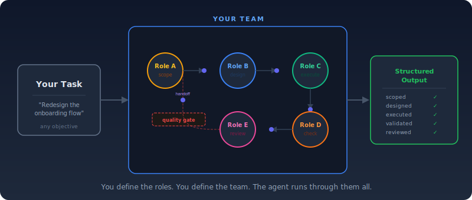
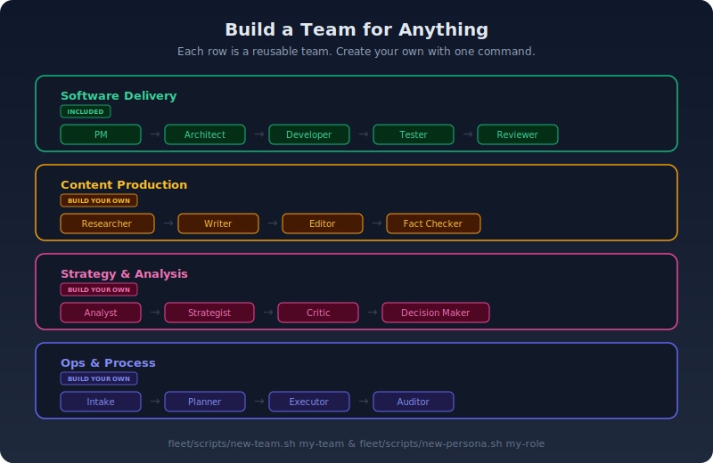
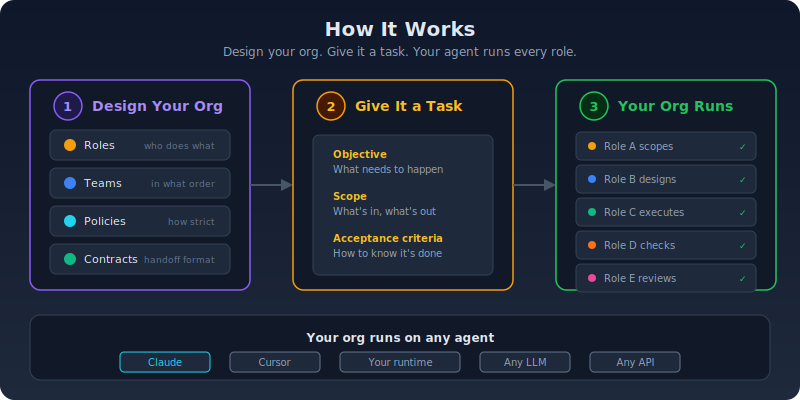

# AgentOrg

Build your own AI organization — a reusable team of agent roles that work together on any task you throw at them.

When you ask an AI to do something, it gives you one shot — one perspective, no review, no structure. Simple tasks work fine. But anything with real stakes benefits from more than one pass and more than one point of view.

AgentOrg lets you design your own organization: the roles, the order they execute, and the quality gates between them. You define it once, then reuse it across every task. The AI runs through your org in sequence, producing structured handoffs between roles. One agent, your org, enforced process.

<p align="center">
  
</p>

## Build a team for anything

A team is a YAML file that names roles, sets their order, and picks a governance policy. A role is a markdown file that defines a mission, required inputs, output format, and exit criteria. You build both with one command each, then reuse them forever.

<p align="center">
  
</p>

AgentOrg ships with `product-delivery` and `docs-enablement` as starter teams. The system is designed for you to build your own — any workflow where structured handoffs between roles improve the output.

## How it works

You define roles, assemble them into teams, and set governance policies. AgentOrg takes your organization definition and your task, and produces a complete set of instructions that any capable agent can execute — each role in sequence, with structured handoffs between them.

<p align="center">
  
</p>

The roles and contracts are the stable layer. The agent that executes them is swappable — Claude today, your own runtime tomorrow.

## Quick start

Run a task through a team:

```bash
fleet/scripts/quick-task.sh team product-delivery "Add retry logic to the API client"
```

This outputs a complete set of instructions. Feed it to Claude.

For an existing task spec:

```bash
fleet/scripts/start-task.sh team product-delivery path/to/my-task.md
```

Solo mode (single role, just execute with guardrails):

```bash
fleet/scripts/start-task.sh solo _ path/to/my-task.md
```

## Build your own org

### Create a role

```bash
fleet/scripts/new-persona.sh fact-checker
```

This creates `fleet/core/personas/fact-checker.md` — a markdown file where you define the role's mission, what inputs it needs, what it must output, and when it's done. Edit it to fit your workflow.

### Create a team

```bash
fleet/scripts/new-team.sh content-review
```

This creates `fleet/core/teams/content-review.yaml` — a YAML file listing roles in execution order, governance policy, and quality gates. Swap in your roles, choose how strict the gates are.

### Create a project

```bash
fleet/scripts/new-project.sh my-project
```

This scaffolds reusable context for a specific domain — background knowledge, standard commands, task templates, and failure runbooks. Projects make your teams smarter about the specific work they're doing.

### Reuse across every task

Once built, your org is permanent. Every new task runs through the same team, same roles, same quality gates. You evolve the org over time — add roles, tighten gates, create specialized teams for different types of work.

## What's inside

```
fleet/
  core/
    personas/       Roles you define — mission, inputs, outputs, exit criteria
    teams/          Team compositions — which roles, what order, what governance
    contracts/      Handoff schema — the structured output every role must produce
    policies/       Governance (quality-first, speed-first) and execution profiles
    modes/          Solo and team workflow definitions
    templates/      Task spec and run summary templates
  scripts/          Org runner and scaffolding tools
  docs/             Architecture, quickstart, customization guides
projects/
  _template/        Reusable project scaffold (tasks, context, commands, runbooks)
```

## Design principles

- **Your org, your rules.** You define the roles, teams, and policies. AgentOrg runs them. The shipped teams are examples, not the product.
- **Build once, reuse forever.** A team is a YAML file. A role is a markdown file. Create them once, run every task through them.
- **Contracts are the API.** The handoff schema is the interface between roles. It's what makes roles composable — any role that speaks the schema can plug into any team.
- **Domain-agnostic.** Software, content, strategy, ops, research — the structure works wherever multiple perspectives improve the output.
- **Agent-agnostic.** Claude today. Your own runtime tomorrow. The org definition doesn't care what executes it.
